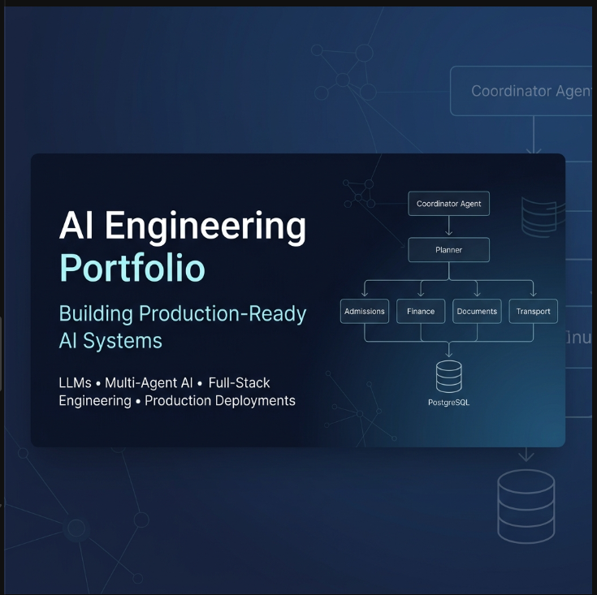
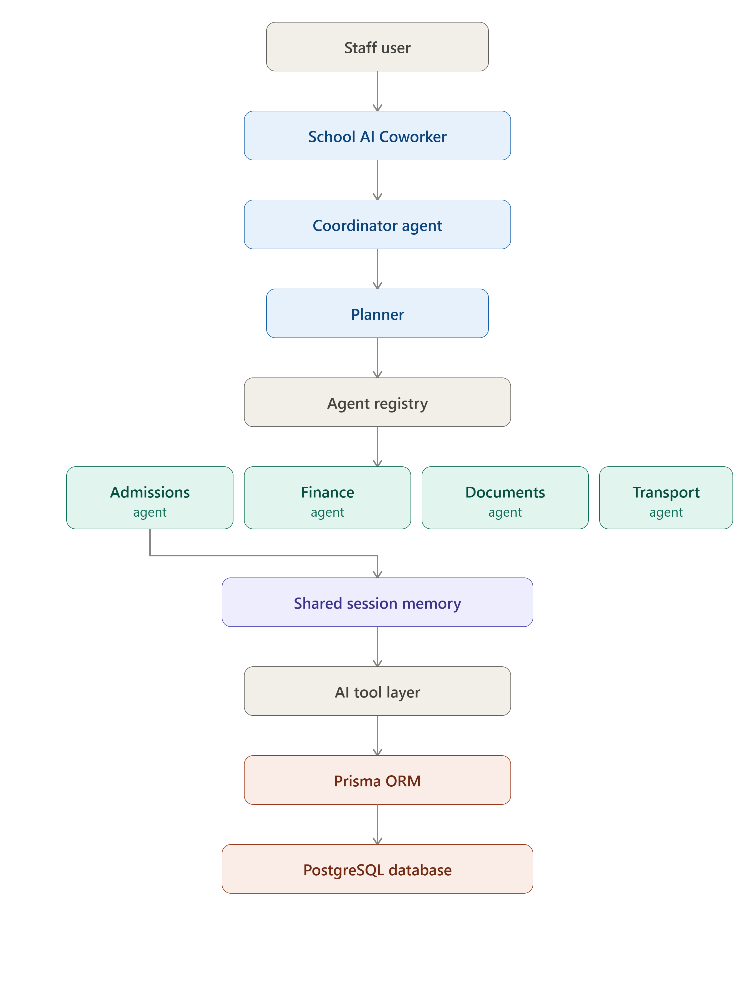
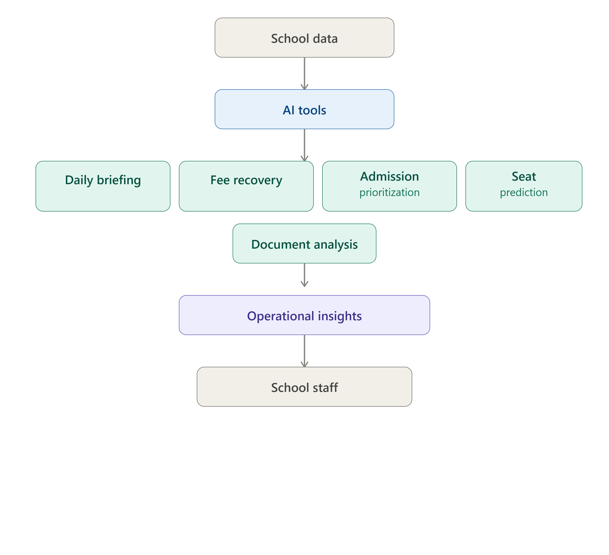
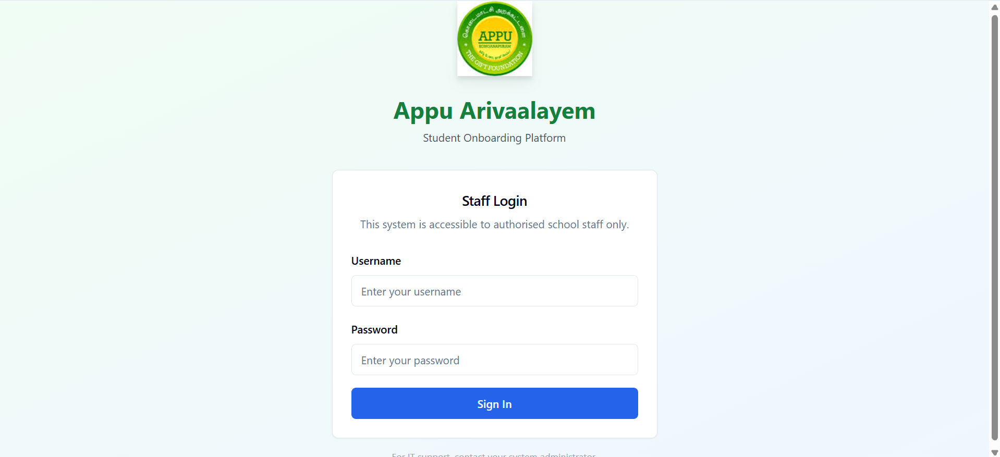
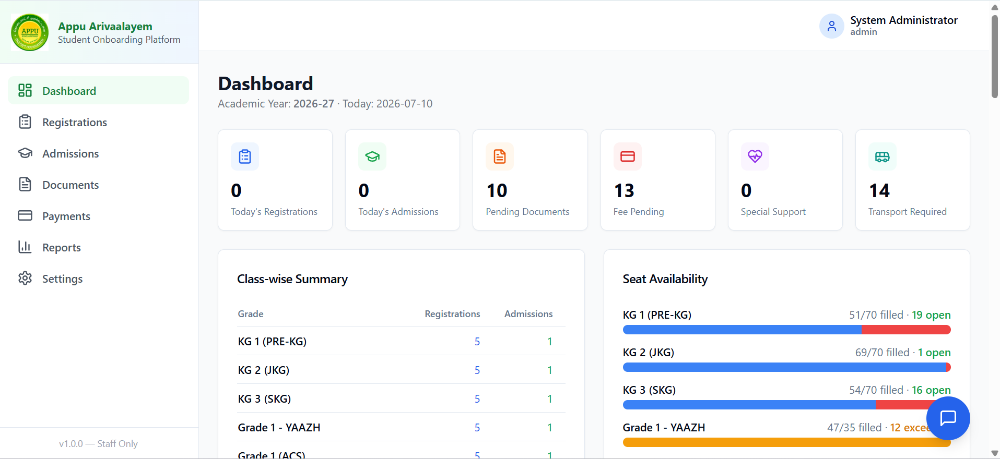
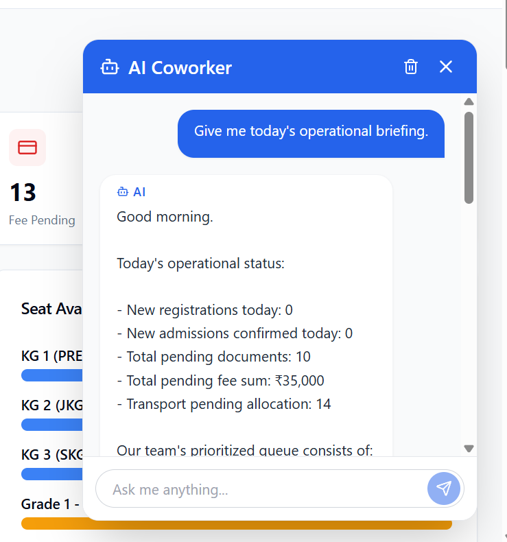
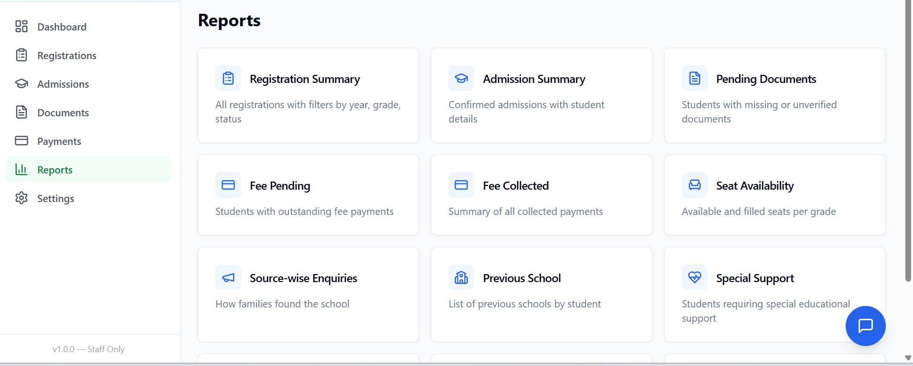
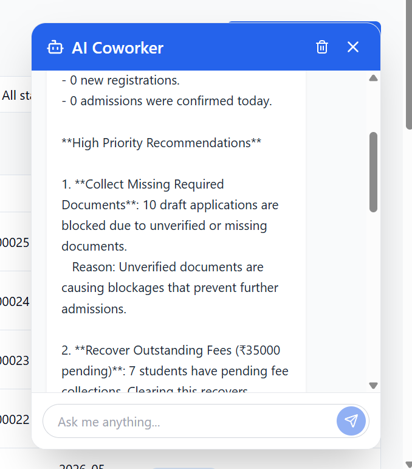

# AI Engineering Portfolio

A showcase of production-grade AI systems, intelligent agents, and engineering-focused software solutions.

---

## Flagship Project: Multi-Agent School AI Coworker

A production-grade, multi-agent AI coworker designed to assist school administrators with registration, admissions, document verification, transport, and finance workflows.

### AI Evolution

The system evolved through three major phases of development:

*   **Version 1 → AI Coworker**
    *   *Description*: A staff-operated school admissions helper utilizing standard LLM tooling and basic database integration to streamline data retrieval.
*   **Version 2 → Operational Intelligence**
    *   *Description*: A workflow assistant capable of data analysis, reports generation, and active decision support for staff members.
*   **Version 3 → Multi-Agent AI System**
    *   *Description*: An enterprise-grade multi-agent architecture featuring a central Coordinator Agent, a Planner, specialized domain agents (Admissions, Finance, Documents, Transport), shared session memory, and cross-agent reasoning loops.

---

## Architecture

A detailed architecture diagram illustrating the complete request flow, coordinator agent, planner, specialist agents, shared memory, and database interactions:

### Overall System Flow

### Multi-Agent Flow

---

## Project Gallery

Here is a visual walk-through of the interface and workflows of the School AI Coworker:

### Login

### Dashboard

### AI Chat

### Analytics

### Multi-Agent Workflow

---

## Future Roadmap

| Project | Status |
|---------|--------|
| Project 2 | Currently Designing (Next Flagship AI Project) |
| Project 3 | Future Work |

---

## Engineering Principles

- Build production-ready software.
- Solve real-world problems with AI.
- Prefer modular and scalable architectures.
- Design AI systems that are explainable.
- Learn by building and deploying.

---

## Connect With Me

- **LinkedIn**: [Mithun Venkatesan](www.linkedin.com/in/mithun-venkatesan-78346528b)
- **GitHub**: [Mithun-Newt](https://github.com/Mithun-Newt)
- **Email**: [smilemit5353@gmail.com](mailto:smilemit5353@gmail.com)
